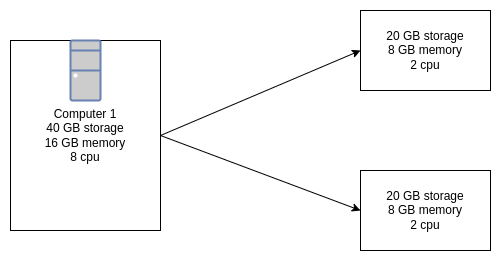

<h1>Virtualization</h1>

It is the techinque of splitting a physical resource into as many logical resource as we want as example- cpu, memory 

Virtualization is technology that transform physical resources (hardware)to logical resources(softwar).

******************

Virtualization can be both spliting resource into multiple resources and merging multiple resources to one resources

