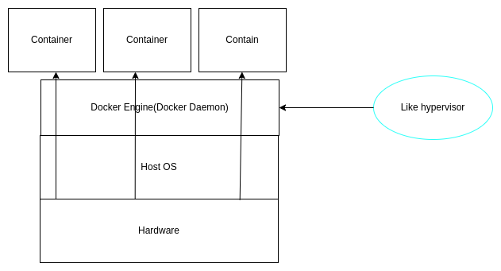
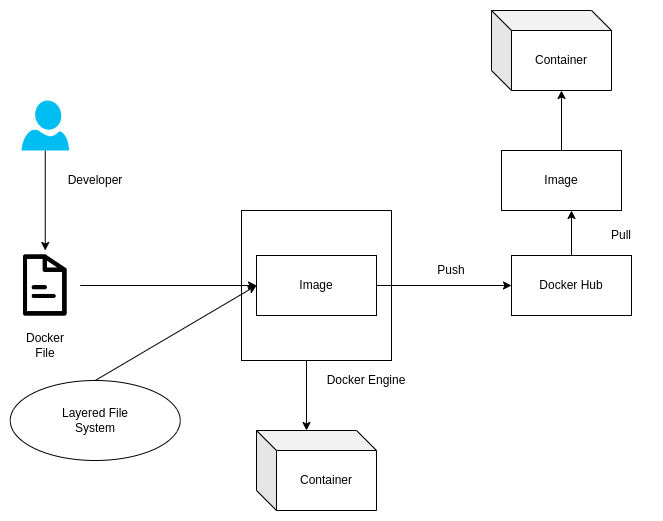
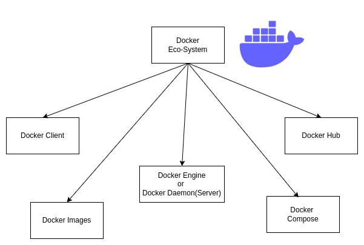

<h1>Table of Contents</h1>

[1. Virtualization](#virtualization) 
    [1.1 A general overview of virtualization](#a-general-overview-of-virtualization) 
    [1.2 Hypervisor](#hypervisor) 
        [1.2.1 Types of Hypervisor](#types-of-hypervisor) 
 [2 Docker](#docker) 
    [2.1 Docker-attach-and-docker-exec ](#docker-attach-and-docker-exec)  
    [2.2 docker-expose-and-publish-p ](#docker-expose-and-publish-p) 
    [2.2 Docker client Server Architecture](#docker-client-server-architecture)

# Virtualization

It is the techinque of splitting a physical resource into as many logical resources as we want as example- cpu, memory 

Virtualization is technology that transform physical resources (hardware)to logical resources(software).

******************

Virtualization can be both types spliting resource into multiple resources and merging multiple resources to one resources. 

  

*****************
## A general overview of virtualization :

Here all the VM are isolated from each other.

Hypervisor is a virtualization software. It vitualize the physical resources.

*****************

## Hypervisor

Hypervisor is a piece of software or firmware that creates and run virtual machine.A hypervisor is sometimes also called a <b>virtual machine manager (VMM)</b>

### Types of hypervisor

<h4>Type-1 Hypervisor(firmware)</h4>

Also called Bare metal hypervisor. Type-1 Hypervisor run directly on the system hardware. A guest OS run on another level above the hypervisor.

<ul>

<li> VMware ESXi is a type-1 hypervisor that runs on the host server hardware without an underlying OS.</li>

<li>Type-1 hypervisor act as their own operating system.</li>

</ul>

ESXi provides  a virtualization layer that abstracts the cpu, storage, memory and 
networking resources of the physical host into multiple virtual machine.

<h5>Type-2 Hypervisor</h5>

Hypervisor that runs within a convention OS environment and the host OS provides.

<ul>

<li>Example of Type-2 hypervisor are Vmware workstation, Oracle Virtual Box and Microsoft Virtual Pc.</li>

<li>It does not have direct access to the host hardware and resources.</li>

</ul>

***************
# Docker 

<ul>

<li>

Docker is an open-source centralised platform designed to create, deploy and run applications.

</li>

<li>

Docker uses container on the host OS to run applications. It allows applications to use the same linux kernel as
a system on the host computer rather than creating a whole virtual OS.

</li>

<li>

We can install docker on any OS but Docker engine runs natively on Linux distribution.

</li>

<li>

Docker written in <b>GO</b> language.

</li>

<li>

Docker is a tool thet performs OS level virtualization also known as containerization. Docker is 
a set of platfrom as a service. While VMware uses hardware level virtualization. 

</li>

<li>

Before DOcker many users faces the problem that a particular code is running in developer's system but not in the User's system.

</li>

<li>

No pre-allocation of RAM.

</li>

</ul>

## Docker Client-Server Architecture

<h3>Docker Daemon</h3>

Docker daemon runs on the host OS. It is responsible for running
containers to manages docker services. Docker Daemon can communicate with other daemon.

<h3>Docker Client</h3>

Docker users can interact with docker daemon through a client(CLI). Docker client uses commands and rest api to communicate with
the docker daemon. When a client runs any server command on the docker client terminal, the client terminal sends these 
docker commands to the docker daemon.It is possible for docker client to communoicate with more than one daemon.

<h3>Docker Host</h3>

Docker Host is used to provide an environment to execute and run applications.
 It contains the docker daemon, images, containers, networks and storages.

 <h3>Docker Hub</h3>

 
Docker registry manages and stores the docker images. Registry can be two types : publiuc and private .

<h3>Docker Images</h3>

Docker images are the read only binary templates used to create docker containers. Or 
single file with all dependencies and configuration required to run a program.

<h3>Ways to create an docker images</h3>

<ol>
 
<li>
Take image from docker Hub
</li>

<li>
Create Image from docker file
</li>

<li>
Create image from existing docker containers
</li>

 </ol>

 <h3>Docker Hub </h3>

 
Conatiners hold the entire packages that is needed to run the application- or The image is a template and the container is a running 
 copy of that template . Images becomes container when they run on docker engine.

## Docker attach and Docker exec

<ul>

<li>
Docker exec creates a new process in the container's  environment while docker attach just connect the standard Input/Output of the main process inside the 
container to corresponding standard Input/Output error of current terminal.
</li>

<li>Docker exec is speciefically for running new things in a already started containers, be it a shell on some process.</li>

</ul>

## Docker Expose and Publish(-p)

<ul>

<li>

If you specify neither expose and -p , the service in the container will only be accessible from inside the container itself.

</li>

<li>

If you expose a port, the service in the container is not accessible from outside docker, but from inside other docker containers.
 So this is good for inter-containers communication. 

</li>

<li>

If you expose and -p a port, this service in the container is accessible from anywhere, even from the outside of the docker.

</li>

<li>

If you do -p but do not expose docker does an emplicit expose. This is because if a port is open to the public, it is automatically also open
to other docker containers. Hence -p includes expose.

</li>

</ul>

