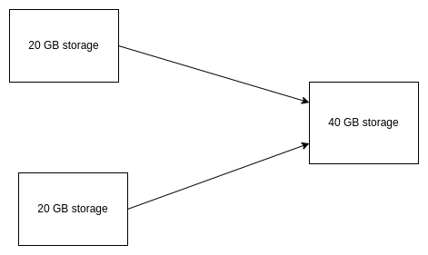
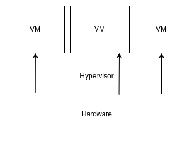
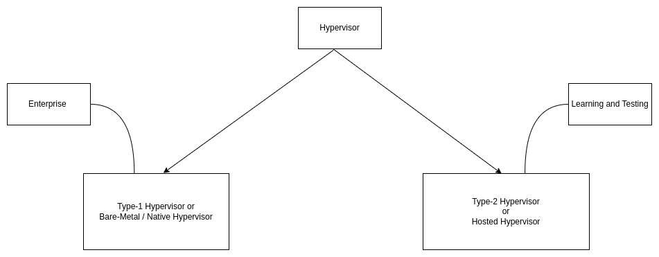
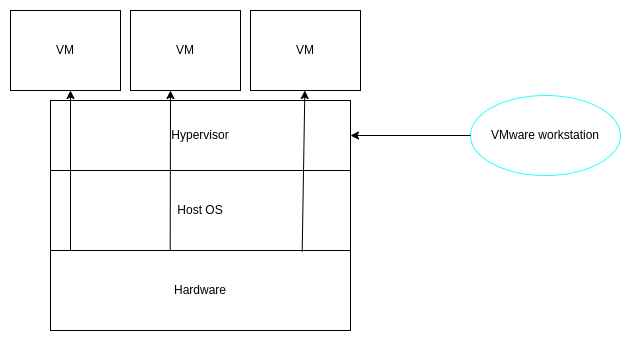

<h1>Table of Contents</h1>

-[1. Virtualization](#virtualization) 
    -[1.1 A general overview of virtualization](#a-general-overview-of-virtualization) 
    -[1.2 Hypervisor](#hypervisor) 
        -[1.2.1 Types of Hypervisor](#types-of-hypervisor) 
 -[2 Docker](#docker) 
    -[2.1 Docker-attach-and-docker-exec ](#docker-attach-and-docker-exec)  
    -[2.2 docker-expose-and-publish-p ](#docker-expose-and-publish-p) 

# Virtualization

It is the techinque of splitting a physical resource into as many logical resources as we want as example- cpu, memory 

Virtualization is technology that transform physical resources (hardware)to logical resources(software).

******************

Virtualization can be both types spliting resource into multiple resources and merging multiple resources to one resources. 

  

*****************
## A general overview of virtualization :

Here all the VM are isolated from each other.

Hypervisor is a virtualization software. It vitualize the physical resources.

*****************

## Hypervisor

Hypervisor is a piece of software or firmware that creates and run virtual machine.A hypervisor is sometimes also called a <b>virtual machine manager (VMM)</b>

### Types of hypervisor

<h4>Type-1 Hypervisor(firmware)</h4>

Also called Bare metal hypervisor. Type-1 Hypervisor run directly on the system hardware. A guest OS run on another level above the hypervisor.

<ul>

<li> VMware ESXi is a type-1 hypervisor that runs on the host server hardware without an underlying OS.</li>

<li>Type-1 hypervisor act as their own operating system.</li>

</ul>

ESXi provides  a virtualization layer that abstracts the cpu, storage, memory and networking resources of the physical host into multiple virtual machine.

<h5>Type-2 Hypervisor</h5>

Hypervisor that runs within a convention OS environment and the host OS provides.

<ul>

<li>Example of Type-2 hypervisor are Vmware workstation, Oracle Virtual Box and Microsoft Virtual Pc.</li>

<li>It does not have direct access to the host hardware and resources.</li>

</ul>

***************
# Docker 

## Docker attach and Docker exec

<ul>

<li>
Docker exec creates a new process in the container's  environment while docker attach just connect the standard Input/Output of the main process inside the 
container to corresponding standard Input/Output error of current terminal.
</li>

<li>Docker exec is speciefically for running new things in a already started containers, be it a shell on some process.</li>

</ul>

## Docker Expose and Publish(-p)

<ul>

<li>

If you specify neither expose and -p , the service in the container will only be accessible from inside the container itself.

</li>

<li>

If you expose a port, the service in the container is not accessible from outside docker, but from inside other docker containers.
 So this is good for inter-containers communication. 

</li>

<li>

If you expose and -p a port, this service in the container is accessible from anywhere, even from the outside of the docker.

</li>

<li>

If you do -p but do not expose docker does an emplicit expose. This is because if a port is open to the public, it is automatically also open
to other docker containers. Hence -p includes expose.

</li>

</ul>

